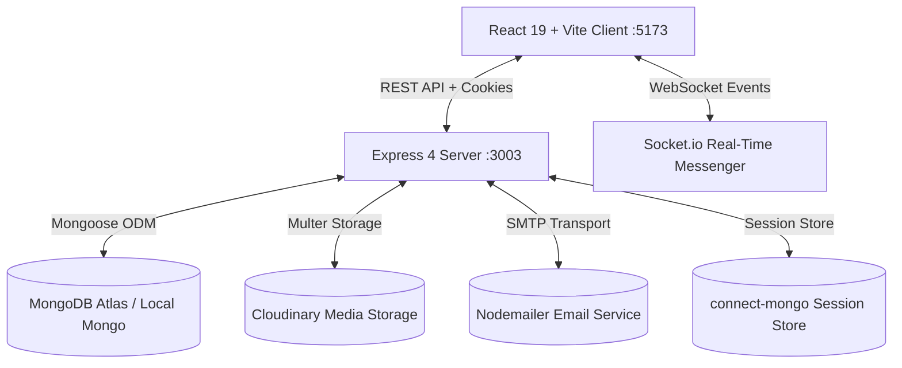

# 🌿 VISTARO — Curated Luxury Travel & Booking Platform

<div align="center">


**An editorial, full-stack travel platform for discovering boutique stays, curated expeditions, host experiences, driver-included cab transfers, and interactive multi-item travel itineraries.**

[](https://react.dev/)
[](https://vitejs.dev/)
[](https://tailwindcss.com/)
[](https://nodejs.org/)
[](https://expressjs.com/)
[](https://www.mongodb.com/)
[](https://socket.io/)

[Live Demo](#-getting-started) • [Key Features](#-key-features) • [Architecture](#-architecture--data-flow) • [Installation](#-getting-started) • [API Overview](#-api-endpoints-overview)

</div>

---

## 📖 Overview

**Vistaro** is a modern, high-aesthetic travel and hospitality web platform engineered with the MERN stack. Designed with an editorial luxury feel, Vistaro unifies fragmented travel planning into a single seamless experience:

* 🏡 **Boutique Stays & Villas:** Curated accommodations with category filters, interactive Leaflet mapping, high-resolution lightboxes, and live date conflict detection.
* 🗺️ **Destinations Catalog:** Regional travel hubs featuring curated state/country guides with linked stays, expeditions, activities, and vehicle transfers.
* 🎒 **Guided Tour Packages:** Multi-day expeditions with day-by-day itinerary timelines, difficulty ratings, and inclusions/exclusions breakdowns.
* 🛶 **Immersive Host Experiences:** Hourly local adventures (Cultural, Culinary, Adventure, Nature, Wellness) led by verified local hosts.
* 🚗 **Driver-Included Cab & Vehicle Transfers:** Airport shuttles, intercity transfers, and local day rentals featuring verified chauffeurs, vehicle specs, and transparent capacity tiers.
* 🧭 **Interactive Travel Planner:** Custom multi-day trip builder allowing travelers to bundle stays, tours, experiences, and transfers into a unified schedule with personal notes.
* 💬 **Real-Time Host Messenger:** Direct listing-linked instant messaging powered by WebSockets (`Socket.io`) with unread counters and read receipts.
* 💳 **Universal Booking & Tiered Refund Engine:** Server-side 18% GST calculation, guest capacity enforcement, automated date math, and tiered cancellation refund policies (`flexible`, `moderate`, `strict`).
* 💱 **Multi-Currency System:** On-the-fly currency switching (`INR ₹`, `USD $`, `EUR €`, `GBP £`, `AED`) with localized formatting.
* 🌓 **Dual-Mode Design System:** Custom semantic color tokens, warm organic terracotta palette, Fraunces serif typography, and dark mode.

---

## 🌟 Tech Stack

### Frontend Client
* **Core Framework:** React 19 (SPA with React Router v7)
* **Build System:** Vite 8 (Hot Module Replacement, code-splitting via `React.lazy`)
* **Styling & Theme:** Tailwind CSS v4 with dual-mode CSS variables (`Light` / `Dark`)
* **Typography:** `Fraunces` (Editorial Serif) & `General Sans` (UI Sans-Serif)
* **Icons:** Lucide React
* **Mapping Engine:** Leaflet + OpenStreetMap
* **Real-Time Messaging:** Socket.io-client
* **HTTP Client:** Axios (configured with credentialed sessions)
* **State Management:** React Context API (`AuthContext`, `CurrencyContext`, `ThemeContext`, `ToastContext`, `SocketContext`)

### Backend Server & Services
* **Runtime:** Node.js (`>=20.0.0`)
* **Web Framework:** Express.js 4
* **Database & ODM:** MongoDB with Mongoose 8
* **Session Persistence:** `express-session` backed by `connect-mongo`
* **Authentication:** Passport.js (Local Strategy with PBKDF2 hashing + Google OAuth 2.0)
* **Real-Time Server:** Socket.io WebSockets
* **Media & Cloud Storage:** Multer + Cloudinary Storage SDK
* **Email Dispatch:** Nodemailer (HTML booking confirmations, cancellation receipts & support tickets)
* **Security & Sanitization:** Joi validation schemas, `sanitize-html` (XSS prevention), `express-mongo-sanitize` (NoSQL injection guard), and `express-rate-limit`

---

## 📁 Repository Structure

```text
VISTARO/
├── client/                          # Frontend Application (React 19 + Vite + Tailwind v4)
│   ├── public/                      # Static assets, branding logo & favicon
│   ├── src/
│   │   ├── api/                     # Domain-specific Axios API client modules
│   │   │   ├── adminApi.js          # Back-office statistics & moderation endpoints
│   │   │   ├── authApi.js           # Auth, profile & host request endpoints
│   │   │   ├── bookingsApi.js       # Booking creation, my-bookings & cancellations
│   │   │   ├── destinationsApi.js   # Destination catalog & slug lookup
│   │   │   ├── experiencesApi.js    # Host experience discovery & booking
│   │   │   ├── inboxApi.js          # Chat threads & message endpoints
│   │   │   ├── listingsApi.js       # Stay accommodation catalog & reviews
│   │   │   ├── tourPackagesApi.js   # Tour package expeditions
│   │   │   ├── transfersApi.js      # Vehicle transfers & cab rentals
│   │   │   └── travelPlansApi.js    # Custom itinerary planner endpoints
│   │   ├── components/              # Modular UI components
│   │   │   ├── auth/                # ProtectedRoute, GuestRoute, AdminRoute, HostAccessGate
│   │   │   ├── booking/             # Universal BookingWidget & price calculator
│   │   │   ├── common/              # LoadingSpinner, StarRating, ToastContainer
│   │   │   ├── destinations/        # DestinationCard & curated grids
│   │   │   ├── experiences/         # ExperienceCard & category filters
│   │   │   ├── home/                # Minimal editorial landing page sections
│   │   │   ├── layout/              # Navbar, MobileBottomNav, Footer, App Layout
│   │   │   ├── listings/            # ListingCard, CategoryBar, FilterModal, ImageGallery, MapView
│   │   │   ├── packages/            # TourPackageCard & difficulty tags
│   │   │   ├── reviews/             # ReviewCard, ReviewForm & host reply thread
│   │   │   ├── transfers/           # TransferCard & vehicle specifications
│   │   │   └── travel-plans/        # AddToPlanModal, CreatePlanModal, TravelPlanCard
│   │   ├── context/                 # Auth, Currency, Theme, Toast, and Socket contexts
│   │   ├── pages/                   # Page views with code-split lazy routes
│   │   ├── index.css                # CSS variables, typography utility classes, keyframes
│   │   └── main.jsx                 # React root mount point
│   ├── index.html                   # HTML entry with Fraunces & General Sans typography
│   ├── package.json                 # Client dependencies & build scripts
│   ├── tailwind.config.js           # Tailwind color palettes, font families & shadows
│   └── vite.config.js               # Vite bundler configuration & backend proxy
│
├── server/                          # Backend Application (Node.js + Express + MongoDB)
│   ├── config/
│   │   ├── db.js                    # Mongoose MongoDB connection establishment
│   │   └── cloudinary.js            # Cloudinary media storage configuration
│   ├── controllers/                 # REST API Controllers
│   │   ├── adminController.js       # Central analytics, user moderation, catalog CRUD
│   │   ├── authController.js        # Registration, login, profile, host request gating
│   │   ├── bookingController.js     # Universal booking engine, overlap math, cancellations
│   │   ├── destinationController.js # Destination catalog & slug resolution
│   │   ├── experienceController.js  # Host experiences catalog & details
│   │   ├── inboxController.js       # Real-time conversations & message dispatch
│   │   ├── listingController.js     # Stay accommodation CRUD & geo-queries
│   │   ├── reviewController.js      # 1-5 star ratings, duplicate guards, owner replies
│   │   ├── supportController.js     # Customer support ticketing & email alerts
│   │   ├── tourPackageController.js # Tour package itineraries
│   │   ├── transferController.js    # Cab rentals & vehicle transfers
│   │   └── travelPlanController.js  # Multi-item travel plan builder
│   ├── middleware/                  # Express middleware pipeline
│   │   ├── auth.js                  # isLoggedIn, isAdmin, isHostOrAdmin, isOwner guards
│   │   ├── rateLimiter.js           # IP throttling on auth and booking routes
│   │   ├── upload.js                # Multer image upload limits and mime-type filters
│   │   └── validate.js              # Joi input validation with XSS sanitization
│   ├── models/                      # Mongoose Document Schemas
│   │   ├── User.js                  # User schema with roles ('user', 'host', 'admin')
│   │   ├── Listing.js               # Stay accommodation with GeoJSON coordinates
│   │   ├── Booking.js               # Universal booking schema (Stays, Packages, Experiences, Transfers)
│   │   ├── Review.js                # Reviews with ratings and host owner replies
│   │   ├── Destination.js           # Travel destination profiles
│   │   ├── TourPackage.js           # Multi-day tour itineraries
│   │   ├── Experience.js            # Host experiences
│   │   ├── Transfer.js              # Cabs, transfers & driver specifications
│   │   ├── TravelPlan.js            # Custom multi-item itinerary plans
│   │   ├── Conversation.js          # Direct chat threads
│   │   ├── Message.js               # WebSocket chat messages
│   │   └── ContactSubmission.js     # Support inquiry tickets
│   ├── routes/                      # REST router definitions mounted under /api/*
│   ├── utils/                       # Async wrappers, error handlers, currency tables, email templates
│   └── server.js                    # Express application entry, Socket.io initialization
│
├── init/                            # Database Seeding Scripts
│   ├── seedDestinations.js          # Curated Indian destinations seeder
│   ├── seedDestinationStays.js      # Luxury villa & stay accommodations seeder
│   ├── seedTourPackages.js          # Multi-day tour packages seeder
│   ├── seedExperiences.js           # Host experiences seeder
│   └── index.js                     # Base catalog seeder
│
├── .env.example                     # Environment variables schema template
├── package.json                     # Root npm script orchestrator (concurrent dev runner)
└── README.md                        # Project documentation
```

---

## 🔑 Key Features

### 1. Curated Discovery & Stays
* Filter accommodations by category: **Beach**, **Farm**, **OMG**, **Arctic**, **Lake**, **Bed & Breakfast**, and **Trending**.
* Refine search by price bounds, destination tags, and amenities.
* Interactive **Leaflet / OpenStreetMap** coordinate viewer.
* Multi-image photo galleries with full-screen keyboard-accessible Lightbox preview.

### 2. Destinations, Tour Packages & Host Experiences
* **Destinations:** Explore rich cultural profiles with state/country identifiers and linked services.
* **Tour Packages:** Multi-day expeditions with difficulty levels, group size caps, and inclusions/exclusions.
* **Host Experiences:** Reserve local activities (Culinary, Adventure, Wellness, Photography) led by local hosts.

### 3. Driver-Included Cab Rentals & Transfers
* Reserve airport shuttles, intercity cabs, scenic routes, and day hires.
* Features verified chauffeur profiles, vehicle specifications (Luggage capacity, AC, registration), and passenger limits.

### 4. Interactive Custom Travel Planner
* Create custom named itineraries with specific travel dates and destinations.
* One-click **"Add to Plan"** modal across any stay, tour package, experience, or transfer card.
* Add personalized traveler notes and manage custom trip schedules.

### 5. Universal Booking & Tiered Refund System
* Server-side pricing calculation with automatic **18% GST** calculation.
* Overlap detection preventing double-booking of stays and vehicles.
* Transparent cancellation policies with automated refund percentage calculations:
  * **Flexible:** 100% refund if cancelled $\ge$ 48 hours before check-in; 0% thereafter.
  * **Moderate:** 100% refund $\ge$ 120 hours (5 days); 50% refund between 48h–120h; 0% thereafter.
  * **Strict:** 50% refund $\ge$ 168 hours (7 days); 0% thereafter.

### 6. Real-Time Host-Guest Chat
* Split-pane chat interface powered by **Socket.io** WebSockets.
* Live message delivery, typing states, unread badge counters, and conversation history.

### 7. Centralized Admin Back-Office
* Complete analytics dashboard tracking platform revenue, total bookings, registered users, and active catalog items.
* Moderate user roles (`user`, `host`, `admin`) and approve/reject host access applications.
* Full CRUD capabilities over Destinations, Tour Packages, Experiences, Transfers, and Stay Listings.

---

## 📐 Architecture & Data Flow



---

## 🚀 Getting Started

### 1. Prerequisites
* **Node.js:** `>= 20.0.0`
* **npm:** `>= 10.0.0`
* **MongoDB:** Local MongoDB instance (`mongodb://127.0.0.1:27017/vistaro`) or a free [MongoDB Atlas](https://www.mongodb.com/cloud/atlas) cluster URL.

### 2. Clone the Repository
```bash
git clone https://github.com/your-username/vistaro.git
cd vistaro
```

### 3. Environment Configuration
Create a `.env` file in the root directory by copying the template:
```bash
cp .env.example .env
```

Open `.env` and fill in your credentials:
```env
PORT=3003
ATLAS_DB_URL=mongodb+srv://<username>:<password>@cluster0.mongodb.net/vistaro?retryWrites=true&w=majority
SESSION_SECRET=your_strong_session_secret_key_here

# Cloudinary (Media storage for listings, tours, and experiences)
CLOUD_NAME=your_cloudinary_cloud_name
CLOUD_API_KEY=your_cloudinary_api_key
CLOUD_API_SECRET=your_cloudinary_api_secret

# Optional Services
GEOAPIFY_API_KEY=your_geoapify_key
CLIENT_URL=http://localhost:5173
```

### 4. Install Dependencies
Install dependencies for both backend and frontend:
```bash
# Install backend dependencies
npm install

# Install frontend dependencies
cd client
npm install
cd ..
```

### 5. Seed the Database (Optional but Recommended)
Populate the database with curated destinations, luxury villas, tour packages, and experiences:
```bash
# Seed initial listings
node init/index.js

# Seed destinations
node init/seedDestinations.js

# Seed destination stays, tours & experiences
node init/seedDestinationStays.js
node init/seedTourPackages.js
node init/seedExperiences.js
```

### 6. Run the Application
Start both the Express backend (`localhost:3003`) and Vite frontend (`localhost:5173`) concurrently:
```bash
npm run dev
```

Open your browser and navigate to:
* 🌐 **Frontend Application:** `http://localhost:5173`
* ⚙️ **Backend Health Endpoint:** `http://localhost:3003/api/health`

---

## 🛠️ Available Scripts

| Command | Description |
| :--- | :--- |
| `npm run dev` | Runs backend server and Vite client concurrently in development mode |
| `npm run server` | Starts only the Express backend server (`server/server.js`) |
| `npm run client` | Starts only the Vite frontend dev server (`client`) |
| `npm run build` | Installs client dependencies and generates production bundle in `client/dist` |
| `npm start` | Starts the production Express server (serves static client build) |

---

## 📡 API Endpoints Overview

| Method | Endpoint | Description | Access |
| :--- | :--- | :--- | :--- |
| `POST` | `/api/auth/signup` | Register a new user account | Public |
| `POST` | `/api/auth/login` | Authenticate user & establish session | Public |
| `GET` | `/api/auth/current-user` | Retrieve active user session & unread counts | Logged In |
| `GET` | `/api/listings` | Paginated catalog of stays with filters | Public |
| `GET` | `/api/listings/:id` | Full accommodation details & reviews | Public |
| `POST` | `/api/listings/:id/bookings`| Reserve a stay accommodation | Logged In |
| `GET` | `/api/destinations` | List curated destinations | Public |
| `GET` | `/api/tour-packages` | List guided multi-day expeditions | Public |
| `GET` | `/api/experiences` | List immersive host experiences | Public |
| `GET` | `/api/transfers` | List cab rentals & vehicle transfers | Public |
| `GET` | `/api/travel-plans` | Retrieve user's custom travel itineraries | Logged In |
| `POST` | `/api/travel-plans/:id/items`| Append stay, package, experience, or transfer | Logged In |
| `GET` | `/api/my-bookings` | Unified list of user bookings across all categories | Logged In |
| `DELETE` | `/api/bookings/:id` | Cancel reservation with automated tiered refund | Logged In |
| `GET` | `/api/inbox` | List real-time conversation threads | Logged In |
| `POST` | `/api/support/contact` | Submit categorized customer support inquiry | Public |
| `GET` | `/api/admin/stats` | Retrieve platform-wide metrics & recent bookings | Admin |

---

## 🛡️ Security & Quality Standards

* **XSS Protection:** User inputs are sanitized using `sanitize-html` within Joi validation schemas.
* **NoSQL Injection Prevention:** `express-mongo-sanitize` strips reserved MongoDB operator characters (`$`, `.`) from request payloads.
* **Session Security:** Cryptographically signed session cookies with `httpOnly: true` and 7-day TTL stored in MongoDB.
* **Rate Limiting:** IP-based request throttling on authentication, review submission, and booking endpoints.
* **Role-Based Access Control:** Strict route-level guards (`isLoggedIn`, `isAdmin`, `isHostOrAdmin`, `isOwner`) protecting privileged resources.
* **Responsive & Accessible:** Full support for mobile, tablet, and desktop viewports with `@media (prefers-reduced-motion: reduce)` accessibility compliance.

---

## 📄 License

This project is licensed under the [ISC License](LICENSE).

---

<div align="center">
  <sub>Crafted with passion for travel and exploration.</sub>
</div>
